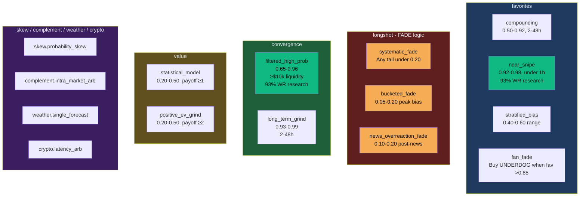

# Polymarket V2 — Application Flow

> Updated: 2026-04-09 — sub-strategy architecture

## Scan Cycle Flow (2 min R&D / 5 min Prod)

```mermaid
flowchart TD
    START([Scan Cycle Starts]) --> RES[Resolution Checker]
    RES --> GAMMA[Gamma API bulk lookup]
    GAMMA --> CLOSED{Market closed<br/>with winner?}
    CLOSED -->|Yes| SETTLE[Settle Position]
    CLOSED -->|No| SKIP1[Keep Open]
    SETTLE --> CREDIT[Credit payout to cash]
    SETTLE --> INSERT_RES[Insert resolution<br/>with sub_strategy_id]

    RES --> ENTITIES[For each active entity]
    ENTITIES --> NORM[Normalize strategy configs<br/>legacy string or EntityStrategyConfig]
    NORM --> EACH_CFG[For each strategy config]
    EACH_CFG --> BUILD_CTX[Build StrategyContext<br/>with enabled_sub_strategies allow-list]
    BUILD_CTX --> EVAL[strategy.evaluate ctx]

    EVAL --> LOOP_SUB[For each sub-strategy]
    LOOP_SUB --> CHECK_EN{isSubStrategyEnabled?}
    CHECK_EN -->|No| NEXT_SUB[Skip]
    CHECK_EN -->|Yes| LOGIC[Run sub-strategy logic]
    LOGIC --> SIGNAL[Emit Signal with<br/>strategy_id + sub_strategy_id]

    SIGNAL --> RISK[Risk Engine]
    RISK --> GATES{Pass all gates?<br/>edge / positions / lockout}
    GATES -->|No| REJECT[Reject Signal]
    GATES -->|Yes| SIZE[Position Sizer]
    SIZE --> KELLY[Fractional Kelly]
    KELLY --> WEIGHT{R&D engine?}
    WEIGHT -->|Yes| WEIGHTER[Weighter multiplier<br/>by strategy|sub_strategy]
    WEIGHT -->|No| PASS[No scaling — prod trusts R&D]
    WEIGHTER --> CAP[Apply % and USD caps]
    PASS --> CAP
    CAP --> ROUTE{Live or Paper?}
    ROUTE -->|Live| CLOB[CLOB API]
    ROUTE -->|Paper| PAPER[Paper Simulator]
    CLOB --> FILL[OrderFill with sub_strategy_id]
    PAPER --> FILL
    FILL --> POS[Upsert Position<br/>with sub_strategy_id]
    FILL --> DEDUCT[Deduct cost from cash]
    POS --> EMIT[Emit SSE events]

    style START fill:#f6ad55,color:#0a0e17
    style SETTLE fill:#10b981,color:#0a0e17
    style REJECT fill:#ef4444,color:white
    style SIGNAL fill:#3b82f6,color:white
    style WEIGHTER fill:#a78bfa,color:white
```

## Strategy Advisor Flow (Prod only, every 10 min)

```mermaid
flowchart LR
    TIMER([10 min Timer]) --> OPEN[Open R&D rd.db<br/>read-only]
    OPEN --> QUERY[SELECT * FROM<br/>v_strategy_performance]
    QUERY --> MAP[Map by strategy|sub_strategy key]
    MAP --> PAIRS[Get all registered pairs<br/>from StrategyRegistry]
    PAIRS --> LOOP[For each pair]

    LOOP --> HAS_DATA{R&D has<br/>data?}
    HAS_DATA -->|No| KEEP1[Keep status quo]
    HAS_DATA -->|Yes| ENABLED{Currently<br/>enabled?}

    ENABLED -->|No| CHK_EN{≥5 resolutions<br/>≥50% WR<br/>P&L > 0?}
    CHK_EN -->|All pass| ENABLE[ENABLE sub-strategy]
    CHK_EN -->|Fail| KEEP2[Keep disabled]

    ENABLED -->|Yes| PROTECTED{Protected?}
    PROTECTED -->|Yes| KEEP3[Keep enabled]
    PROTECTED -->|No| CHK_DIS{≥10 resolutions<br/>WR < 30%<br/>P&L < 0?}
    CHK_DIS -->|All fail| DISABLE[DISABLE sub-strategy]
    CHK_DIS -->|Pass| KEEP4[Keep enabled]

    ENABLE --> REBUILD[Rebuild EntityStrategyConfig]
    DISABLE --> REBUILD
    REBUILD --> UPDATE[entityManager.updateStrategies]
    UPDATE --> EMIT[Emit SSE advisor:check_complete]
    UPDATE --> CLOSE[Close R&D db]

    style TIMER fill:#3b82f6,color:white
    style ENABLE fill:#10b981,color:#0a0e17
    style DISABLE fill:#ef4444,color:white
```

## Strategy Weighter Flow (R&D only, every 5 min)

```mermaid
flowchart LR
    TIMER([5 min Refresh]) --> PERF[Query v_strategy_performance]
    PERF --> EACH[For each strategy|sub_strategy row]

    EACH --> NODATA{0 resolutions?}
    NODATA -->|Yes| UN[Unproven: 0.25x]

    EACH --> LOWDATA{<5 resolutions?}
    LOWDATA -->|Yes| UN2[Unproven: 0.4x]

    EACH --> PROVEN{WR ≥ 60%<br/>P&L > 0?}
    PROVEN -->|Yes| HIGH[Proven: 1.0 - 2.0x<br/>boost = 1 + WR-60/100]

    EACH --> PROMISING{WR ≥ 40%<br/>P&L ≥ 0?}
    PROMISING -->|Yes| MED[Promising: 0.6x]

    EACH --> UNDER[Underperforming]
    UNDER --> LOW[Min sizing: 0.15x]

    UN --> MAP[Store in weights Map<br/>keyed by strategy|sub]
    UN2 --> MAP
    HIGH --> MAP
    MED --> MAP
    LOW --> MAP

    MAP --> LOOKUP[Position Sizer looks up<br/>getWeight strategy_id, sub_strategy_id]
    LOOKUP --> FB{Exact match?}
    FB -->|No| PFB[Fall back to parent]
    PFB --> NFB{Parent match?}
    NFB -->|No| AVG[Average all subs of parent]
    NFB -->|Yes| USE[Use parent weight]
    FB -->|Yes| USE
    AVG --> USE
    USE --> APPLY[Multiply Kelly size by weight]

    style TIMER fill:#f6ad55,color:#0a0e17
    style HIGH fill:#10b981,color:#0a0e17
    style LOW fill:#ef4444,color:white
    style APPLY fill:#a78bfa,color:white
```

## Sub-Strategy Hierarchy


