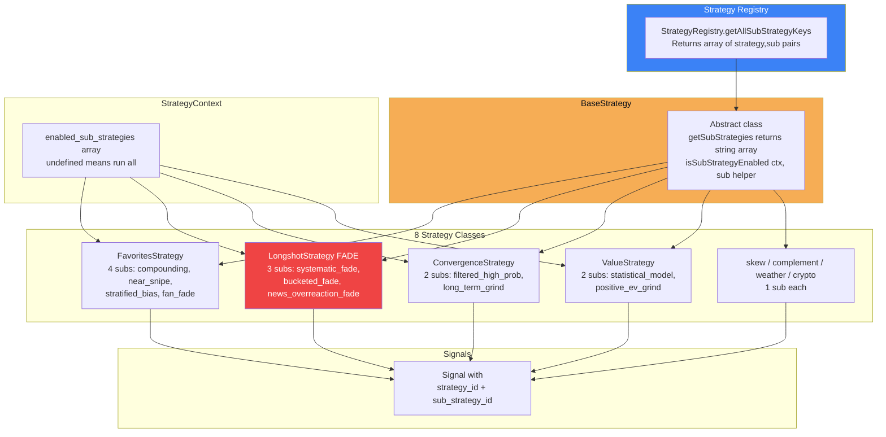
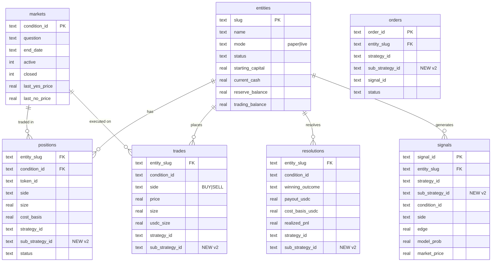

# Polymarket V2 — System Architecture

> Updated: 2026-04-09 — sub-strategy architecture

## High-Level Architecture

```mermaid
graph TB
    subgraph VPS["DigitalOcean VPS (178.62.225.235:2222)"]
        subgraph PROD["Prod Engine (port 9100)"]
            PE[Engine<br/>5 min scan] --> PR[Risk Engine]
            PR --> PS[Position Sizer<br/>Kelly + Caps]
            PE --> RC1[Resolution Checker<br/>Gamma API bulk]
            PE --> SA[Strategy Advisor<br/>10 min per-sub promotion]
            PE --> PD[Dashboard<br/>sageadvisors.ai]
            PE --> CR[CLOB Router<br/>Live Orders]
            PE -.-> DB1[(polybot.db<br/>schema v2)]
        end

        subgraph RD["R&D Engine (port 9200)"]
            RE[Engine<br/>2 min scan] --> RR[Risk Engine]
            RR --> RS[Position Sizer<br/>Kelly + Weighter]
            RS --> SW[Strategy Weighter<br/>per strategy|sub tier]
            RE --> RC2[Resolution Checker<br/>Gamma API bulk]
            RE --> RDD[Dashboard<br/>rd.sageadvisors.ai]
            RE --> PP[Paper Simulator]
            RE -.-> DB2[(rd.db<br/>schema v2)]
        end

        SA -->|"read-only SQLite<br/>/api/rd-strategies"| DB2
        PD -->|"proxies R&D data"| SA

        subgraph NGINX["Nginx Reverse Proxy"]
            N1[sageadvisors.ai → :9100]
            N2[rd.sageadvisors.ai → :9200]
        end

        subgraph V1[V1 Legacy]
            AR[auto_redeem.py<br/>cron 30 min]
        end
    end

    subgraph EXT["External APIs"]
        CLOB[Polymarket CLOB<br/>Markets + Orders]
        GAMMA[Polymarket Gamma<br/>Bulk market metadata<br/>Resolution status]
        WS[Polymarket WS<br/>Orderbook]
        METEO[Open-Meteo<br/>Weather]
        CRYPTO[Binance + CoinGecko<br/>Crypto Prices]
    end

    subgraph CHAIN["Polygon Blockchain"]
        WALLET[0xF8d12267...<br/>USDC Wallet]
    end

    PE --> CLOB
    PE --> GAMMA
    PE --> WS
    RE --> CLOB
    RE --> GAMMA
    RE --> METEO
    RE --> CRYPTO
    CR --> WALLET
    AR --> WALLET

    style PROD fill:#1a1f2e,color:#e2e8f0,stroke:#f6ad55,stroke-width:2px
    style RD fill:#1a1f2e,color:#e2e8f0,stroke:#3b82f6,stroke-width:2px
    style SA fill:#f6ad55,color:#0a0e17
    style SW fill:#3b82f6,color:white
```

## Sub-Strategy Architecture Layer



## Source Code Architecture

```mermaid
graph LR
    subgraph CORE["core/"]
        engine[engine.ts<br/>normalizes configs<br/>passes sub allow-list]
        events[event-bus.ts]
        lifecycle[lifecycle.ts]
        logger[logger.ts]
    end

    subgraph RISK["risk/"]
        risk_eng[risk-engine.ts<br/>passes sub_strategy_id<br/>to OrderRequest]
        pos_sizer[position-sizer.ts<br/>weighter lookup by strategy|sub]
        res_check[resolution-checker.ts<br/>Gamma API bulk]
        advisor[strategy-advisor.ts<br/>per-pair promotion]
        weighter[strategy-weighter.ts<br/>keyed by strategy|sub]
        stop_loss[stop-loss-monitor.ts]
        daily_loss[daily-loss-guard.ts]
    end

    subgraph STRAT["strategy/"]
        registry[strategy-registry.ts<br/>getAllSubStrategyKeys]
        context[strategy-context.ts<br/>enabled_sub_strategies]
        base[strategy-interface.ts<br/>BaseStrategy+getSubStrategies]
        subgraph CUSTOM["custom/ (8 strategies, 15+ subs)"]
            fav[favorites x4 subs]
            val[value x2 subs]
            long[longshot x3 subs FADE]
            conv[convergence x2 subs]
            skew[skew]
            comp[complement]
            weather[weather]
            crypto[crypto]
        end
    end

    subgraph EXEC["execution/"]
        clob[clob-router.ts<br/>propagates sub_strategy_id]
        paper[paper-simulator.ts<br/>propagates sub_strategy_id]
        builder[order-builder.ts]
    end

    subgraph STORAGE["storage/ (schema v2)"]
        db[database.ts]
        schema[schema.ts<br/>sub_strategy_id col on<br/>signals/orders/trades/<br/>positions/resolutions]
        subgraph REPOS["repositories/"]
            ent_repo[entity-repo]
            pos_repo[position-repo]
            trade_repo[trade-repo]
            res_repo[resolution-repo]
            mkt_repo[market-repo]
            sig_repo[signal-repo]
        end
    end

    subgraph ENTITY["entity/"]
        mgr[entity-manager.ts<br/>EntityStrategyConfig]
        wallet[wallet-loader.ts]
    end

    subgraph DASH["dashboard/"]
        sse[sse-server.ts<br/>/api/rd-strategies<br/>Sub-Strategy columns]
        html[static/index.html]
    end

    subgraph CONFIG["config/"]
        loader[loader.ts]
        zod[schema.ts]
    end

    engine --> risk_eng
    engine --> res_check
    engine --> advisor
    engine --> registry
    engine --> clob
    engine --> mgr
    engine --> sse
    risk_eng --> pos_sizer
    risk_eng --> weighter
    pos_sizer --> weighter
    registry --> base
    base --> CUSTOM
    clob --> paper
    advisor --> STORAGE
    weighter --> STORAGE

    style CORE fill:#f6ad55,color:#0a0e17
    style RISK fill:#ef4444,color:white
    style STRAT fill:#10b981,color:#0a0e17
    style STORAGE fill:#3b82f6,color:white
```

## Database Schema (v2)



## Network Topology

```
Internet
  │
  ├── sageadvisors.ai ──→ Nginx (:443) ──→ Prod Dashboard (:9100)
  │                                          ├── /api/strategies (local)
  │                                          └── /api/rd-strategies ──→ rd.db (read-only)
  ├── rd.sageadvisors.ai ──→ Nginx (:443) ──→ R&D Dashboard (:9200)
  │                                          └── /api/strategies (local = R&D)
  │
  └── SSH (:2222) ──→ VPS Management

VPS Internal
  ├── Prod Engine (:9100) ──→ polybot.db (schema v2)
  │     ├── StrategyAdvisor polls rd.db every 10 min
  │     ├── Gamma API (bulk resolution lookup)
  │     ├── CLOB API (orders + market data)
  │     └── WebSocket (orderbook)
  │
  ├── R&D Engine (:9200) ──→ rd.db (schema v2)
  │     ├── StrategyWeighter refreshes every 5 min
  │     ├── Gamma API (bulk resolution lookup)
  │     ├── CLOB API (market data only, paper fills)
  │     ├── Open-Meteo (weather)
  │     └── Binance/CoinGecko (crypto)
  │
  └── V1 Legacy
        └── auto_redeem.py (cron, on-chain only)
```
